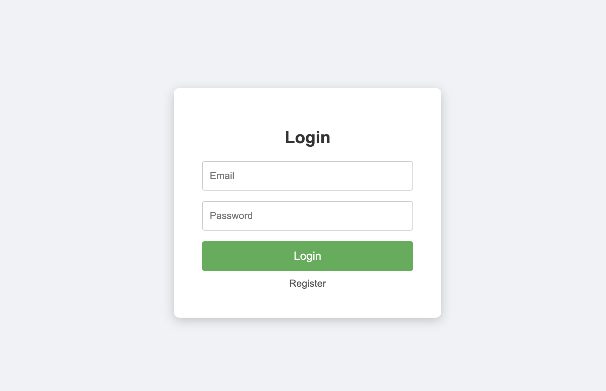
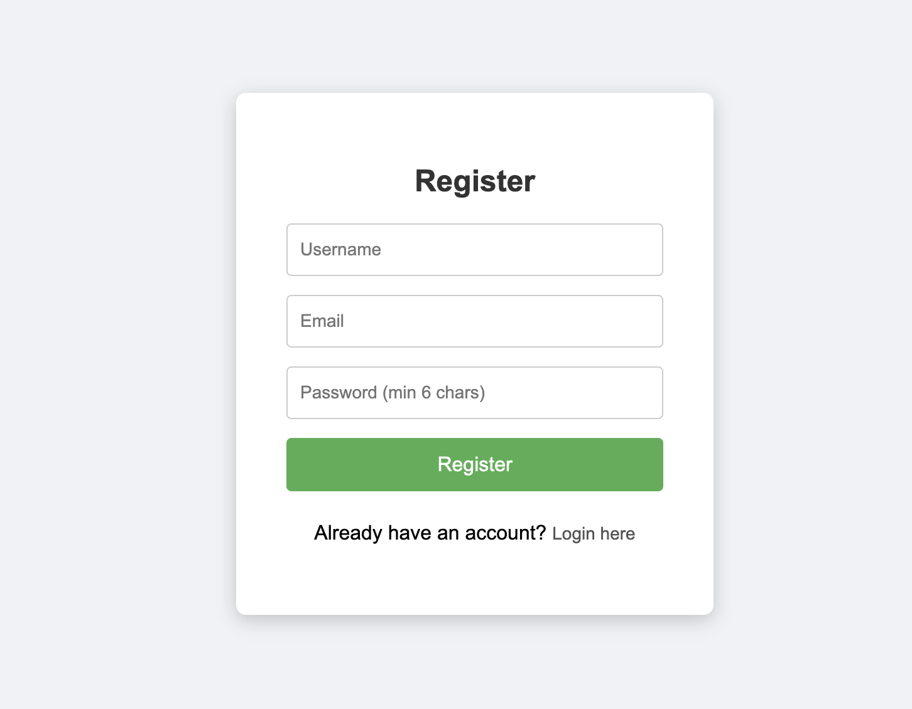
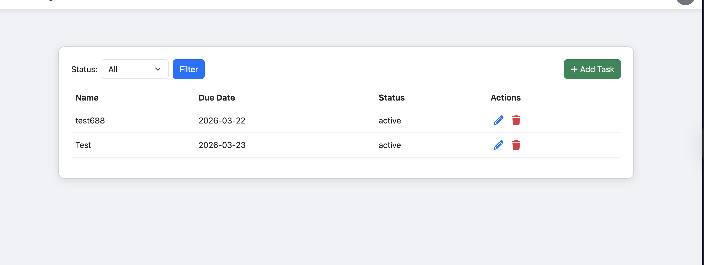

# Task Manager (PHP + MySQL)

A simple Task Management Application built using **core PHP** and **MySQL**.  
This application allows authenticated users to manage their tasks with full CRUD functionality and a modern, responsive UI.

---

## Features

- User authentication (Login & Register)
- Task management (Create, Read, Update, Delete)
- Filter tasks by status (Active / Completed)
- Modal-based task creation & editing & deletiing
- Responsive and clean UI with **Bootstrap 5**
- Font Awesome icons for task actions
- AJAX-powered Add, Edit, Delete without page reload

---

## Tech Stack

- **PHP** (Core PHP)
- **MySQL**
- **HTML, CSS, JavaScript**
- **Bootstrap 5**
- **Font Awesome 6**

---

## Project Setup

### 1️⃣ Clone the Repository

```bash
git clone https://github.com/jsgie/task-manager-php.git
cd task-manager-php

```

### 2️⃣ Setup MySQL Database

Login to MySQL:

```bash
mysql -u root -p
```

Run the following SQL commands:

```bash
CREATE DATABASE task_manager;

CREATE USER 'taskuser'@'localhost' IDENTIFIED BY 'password';

GRANT ALL PRIVILEGES ON task_manager.* TO 'taskuser'@'localhost';

FLUSH PRIVILEGES;
```

3️⃣ Configure Database Connection

Open src/Database.php and update credentials if needed:

```bash
$this->db = new mysqli('localhost', 'taskuser', 'password', 'task_manager');
```
4️⃣ Run the Application

```bash
php -S localhost:8000 -t public
```

5️⃣ Access in Browser

http://localhost:8000

### Default User

A default admin user is automatically created:

- Username: admin@example.com
- Password: password

### Usage
- Register a new user OR login with default credentials
- Add tasks using the “Add Task” button
- Edit tasks by clicking the pencil icon
- Delete tasks using the trash icon
- Filter tasks by status (Active / Completed)


### Screenshots

Login Page


Register Page


Tasks Page



